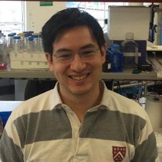

.. title:
.. slug:
.. date: 2020-08-29 23:44:45 UTC+02:00
.. tags:
.. category:
.. link:
.. description:
.. type: text
.. hidetitle: True

Herzlich willkommen auf meiner persönlichen Website. Ich bin derzeit Postdoktorand im `Labor von
Nikolaus Rajewsky`_ am `Berliner Institut für Medizinische Systembiologie`_, wo ich derzeit die
RNA-Biologie `neurodegenerativer Erkrankungen`_ wie ALS mit räumlich und long-read Ansätze (`CZI`_), und kürzlich `SARS-CoV-2`_
unter Verwendung der Sequenzierung der nächsten Generation von
Virus-infizierte Epithelzellen oder virusinduzierte Endothelzellen (`BMBF`_).
Früher habe ich neue Ansätze verwendet, um `RNA-Termini`_ im `Bartel-Labor`_ am MIT
zu finden, und Einzelzell-Immunologie erforscht in der `Biotech-Industrie`_ und auf der `UNSW`_ in Sydney.

Es macht mir Spaß, an `Bioinformatik-`_ und `Bildungsprojekten`_ mitzuwirken,
mein `Rennrad`_ zu fahren, `Deutsch`_ zu lernen und zu `schreiben`_.

.. _`Labor von Nikolaus Rajewsky`: https://www.mdc-berlin.de/n-rajewsky
.. _`Berliner Institut für Medizinische Systembiologie`: https://www.mdc-berlin.de/bimsb
.. _`neurodegenerativer Erkrankungen`: https://www.mdc-berlin.de/news/press/organoids-and-sequencing-team-als-research
.. _`SARS-CoV-2`: https://www.gesundheitsforschung-bmbf.de/de/ansatzpunkt-fur-wirkstoffe-gegen-covid-19-die-genregulation-12263.php
.. _`Rennrad`: https://www.strava.com/athletes/1316867
.. _`Deutsch`: https://learngerman.dw.com/en/overview
.. _`Bioinformatik-`: https://snakemake.readthedocs.io
.. _`Bildungsprojekten`: https://www.youtube.com/watch?v=h2CJ-qr8fjs&feature=youtu.be
.. _`schreiben`: blog
.. _`CZI`: https://medium.com/@cziscience/supporting-bold-and-transformative-ideas-in-neurodegeneration-47e69b4e215f
.. _`BMBF`: https://www.gesundheitsforschung-bmbf.de/de/erforschung-von-covid-19-im-zuge-des-ausbruchs-von-sars-cov-2-11483.php
.. _`RNA-Termini`: https://www.ncbi.nlm.nih.gov/pmc/articles/PMC4446424/
.. _`Bartel-Labor`: http://bartellab.wi.mit.edu/
.. _`Biotech-Industrie`: https://www.biorxiv.org/content/10.1101/134841v1
.. _`UNSW`: https://kirby.unsw.edu.au/people/dr-fabio-luciani
